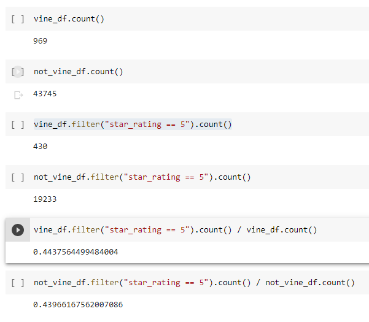

# Amazon_Vine_Analysis

## Overview of Analysis
The goal of this analysis was to look at Amazon product reviews, and determine if the Vine program, which provides a client a free product in exchange for a review, results in biased reviews.

## Results
This analysis looked at the data available for office products.

* There were 969 reviews as part of the Vine program, and 43745 that were not associated with it.

* Of these, 430 Vine reviews were 5 star review, and 19233 non-Vine reviews were 5 star.

* This results in 44.3% of Vine reviews being 5 star, while 43.9% of non-Vine reviews were 5 star.

## Summary

The overall percentage of Vine reviews is low. These reviews do come in at 5 star a higher percentage of the time for office products. However, this gap is 0.4%. The gap exists, but is not large enough to present strong evidence of a large bias on its own. Further study could be done with this data set looking at the average review on a 5 star scale, rather than simply the 5 star reviews overall. We could also look at the quantity of these reviews against the regular reviews, and see if they play a statistically significant role in the overall rating of products.
